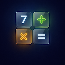
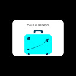
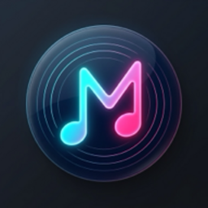
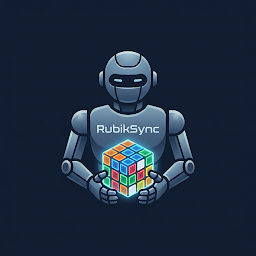

<!-- ╔══════════════════════════════════════════════════════════════╗ -->
<!-- ║                    VAHIT KESKIN                              ║ -->
<!-- ║              Senior Android Engineer                         ║ -->
<!-- ╚══════════════════════════════════════════════════════════════╝ -->

<div align="center">
  
</div>

<div align="center">
  <a href="https://git.io/typing-svg">
    
  </a>
</div>

<br/>

<!-- ═══════════════════ QUICK LINKS ═══════════════════ -->

<div align="center">
  <a href="https://vahitkeskin.github.io/iamvahitkeskin/"></a>&nbsp;
  <a href="https://www.linkedin.com/in/vahit-keskin/"></a>&nbsp;
  <a href="https://play.google.com/store/apps/developer?id=vahitkeskin"></a>&nbsp;
  <a href="https://medium.com/@vahitkeskin"></a>&nbsp;
  <a href="mailto:vahitkeskin07@gmail.com"></a>
</div>

<br/>

<div align="center">
  
  &nbsp;&nbsp;
  
  &nbsp;&nbsp;
  
  &nbsp;&nbsp;
  
</div>

<br/>

<!-- ═══════════════════ CONTRIBUTION GRAPH ═══════════════════ -->

<div align="center">
  
</div>

<br/>

<div align="center">
  
</div>

---

<!-- ═══════════════════ ABOUT ═══════════════════ -->

##  &nbsp;About Me

```kotlin
object VahitKeskin {
    val name       = "Vahit Keskin"
    val role       = "Senior Android Engineer"
    val company    = "Türk Telekom"
    val location   = "İzmir, Türkiye 🇹🇷"
    val experience = "5+ years"
    val apps       = "11+ on Google Play"

    val skills = listOf("Kotlin", "Jetpack Compose", "Clean Architecture", "MVVM / MVI")
    val learning = listOf("AI / Python", "Cyber Security")
}
```

**Computer Engineer** with **5+ years** of experience building large-scale, multi-module Android applications for **millions of users**. Currently at **Türk Telekom**, building device-to-device data-transfer features and strengthening error-management stability for production apps.

Independently **design, develop, and publish** apps on the **Google Play Store** — spanning productivity, communication, utilities, and games.

<br/>

> 🔭 &nbsp;Building modern Android apps with **Jetpack Compose**, Coroutines & Flow
> 
> 🏗️ &nbsp;Architecting multi-module, **Clean Architecture**, MVVM / MVI, SOLID
> 
> 📱 &nbsp;Shipped **11+ apps** independently on Google Play
> 
> 🤖 &nbsp;Exploring **Python / AI** integration & **Cyber Security**
> 
> 🎤 &nbsp;Mentoring & speaking at high schools about Software Engineering

---

<!-- ═══════════════════ PUBLISHED APPS ═══════════════════ -->

<!-- 👑 PUBLISHED APPS GRID 👑 -->
<div align="center">
<table>
<!-- Row 1 -->
<tr>
<td align="center" width="33%">
<br/>
<b>⭐ Equatix</b><br/>
<sub>Education / Math</sub><br/>
<sub>Interactive math app — rated <b>5.0</b> ⭐</sub><br/>
<sub><code>Kotlin</code> <code>Compose</code></sub><br/><br/>
<a href="https://play.google.com/store/apps/details?id=com.vahitkeskin.equatix"></a>
<a href="https://github.com/vahitkeskin/Equatix"></a>
</td>
<td align="center" width="33%">
<br/>
<b>📡 BluMesh</b><br/>
<sub>Communication</sub><br/>
<sub>P2P messaging — fully <b>offline</b></sub><br/>
<sub><code>Kotlin</code> <code>Bluetooth/P2P</code></sub><br/><br/>
<a href="https://play.google.com/store/apps/details?id=com.vahitkeskin.blumesh"></a>
<a href="https://github.com/vahitkeskin/BluMesh"></a>
</td>
<td align="center" width="33%">
<br/>
<b>📚 LetSwApp</b><br/>
<sub>Social / Books</sub><br/>
<sub>Book-exchange platform for readers</sub><br/>
<sub><code>Kotlin</code> <code>Firebase</code></sub><br/><br/>
<a href="https://play.google.com/store/apps/details?id=com.vahitkeskin.letswapp"></a>
<a href="https://github.com/vahitkeskin/TellaKitap"></a>
</td>
</tr>
<!-- Row 2 -->
<tr>
<td align="center" width="33%">
<br/>
<b>🔔 Hatırlatıcım</b><br/>
<sub>Productivity</sub><br/>
<sub>Smart reminder & notification manager</sub><br/>
<sub><code>Kotlin</code> <code>WorkManager</code></sub><br/><br/>
<a href="https://play.google.com/store/apps/details?id=com.vahitkeskin.hatirlaticim"></a>
<a href="https://github.com/vahitkeskin/Hatirlaticim"></a>
</td>
<td align="center" width="33%">
<br/>
<b>📐 Tel Çit Hesaplama</b><br/>
<sub>Tools / Utility</sub><br/>
<sub>Fence-material calculator</sub><br/>
<sub><code>Kotlin</code> <code>Compose</code></sub><br/><br/>
<a href="https://play.google.com/store/apps/details?id=com.vahitkeskin.fencecalculator"></a>
<a href="https://github.com/vahitkeskin/FenceCalculator"></a>
</td>
<td align="center" width="33%">
<br/>
<b>📝 ActiveNote</b><br/>
<sub>Productivity</sub><br/>
<sub>Fast, lightweight note-taking</sub><br/>
<sub><code>Kotlin</code> <code>Room</code></sub><br/><br/>
<a href="https://play.google.com/store/apps/details?id=org.vahitkeskin.activenote"></a>
<a href="https://github.com/vahitkeskin/ActiveNote"></a>
</td>
</tr>
<!-- Row 3 -->
<tr>
<td align="center" width="33%">
<br/>
<b>🧳 Yolculuk Defterim</b><br/>
<sub>Travel / Lifestyle</sub><br/>
<sub>Personal travel journal & trip logger</sub><br/>
<sub><code>Kotlin</code> <code>Room</code></sub><br/><br/>
<a href="https://play.google.com/store/apps/details?id=com.vahitkeskin.yolculukdefterim"></a>
<a href="https://github.com/vahitkeskin/YolculukDefterim"></a>
</td>
<td align="center" width="33%">
<br/>
<b>🧠 Iradix</b><br/>
<sub>Wellbeing</sub><br/>
<sub>Digital willpower & habit tracker</sub><br/>
<sub><code>Kotlin</code> <code>Compose</code></sub><br/><br/>
<a href="https://play.google.com/store/apps/details?id=com.vahitkeskin.iradix"></a>
<a href="https://github.com/vahitkeskin/Iradix"></a>
</td>
<td align="center" width="33%">
<br/>
<b>🩸 Gölge Meclisi</b><br/>
<sub>Game</sub><br/>
<sub>Social-deduction party game</sub><br/>
<sub><code>Kotlin</code> <code>Compose</code></sub><br/><br/>
<a href="https://play.google.com/store/apps/details?id=com.vahitkeskin.golgemeclisi"></a>
<a href="https://github.com/vahitkeskin/GolgeMeclisi"></a>
</td>
</tr>
<!-- Row 4 -->
<tr>
<td align="center" width="33%">
<br/>
<b>🎧 Müzik Çalar</b><br/>
<sub>Music / Audio</sub><br/>
<sub>Advanced player & widgets</sub><br/>
<sub><code>Kotlin</code> <code>Compose</code></sub><br/><br/>
<a href="https://play.google.com/store/apps/details?id=com.vahitkeskin.musixy"></a>
<a href="https://github.com/vahitkeskin/Musixy"></a>
</td>
<td align="center" width="33%">
<br/>
<b>🧩 RubikSync</b><br/>
<sub>Education / Utility</sub><br/>
<sub>AI Matrix Rubik's Cube solver</sub><br/>
<sub><code>Kotlin</code> <code>Compose</code></sub><br/><br/>
<a href="https://play.google.com/store/apps/details?id=com.vahitkeskin.rubiksync"></a>
<a href="https://github.com/vahitkeskin/RubikSync"></a>
</td>
<td align="center" width="33%">
<br/>
<b>⚡ Coding...</b><br/>
<sub>Android Bot</sub><br/>
<sub>Building next scalable app</sub><br/>
<sub><code>Kotlin</code> <code>Compose</code></sub><br/><br/>
<a href="https://play.google.com/store/apps/developer?id=vahitkeskin"></a>
<a href="https://github.com/vahitkeskin"></a>
</td>
</tr>
</table>
</div>

<div align="center">
  <br/>
  <a href="https://play.google.com/store/apps/developer?id=vahitkeskin">
    
  </a>
</div>

---

<!-- ═══════════════════ TECH STACK ═══════════════════ -->

## 🛠️ Tech Stack

<div align="center">

**Languages**


**Android & UI**


**Architecture & DI**


**Data & Networking**


**Testing & DevOps**


</div>

---

<!-- ═══════════════════ GITHUB ANALYTICS ═══════════════════ -->

## 📊 GitHub Analytics

<div align="center">
  
  &nbsp;&nbsp;&nbsp;
  
</div>

<br/>

<div align="center">
  <a href="https://github.com/vahitkeskin">
    
  </a>
</div>

<div align="center">
  
  &nbsp;
  
</div>

---

<!-- ═══════════════════ EXPERIENCE ═══════════════════ -->

## 💼 Professional Experience

<div align="center">
<table>
<tr>
<td>

**🏢 Türk Telekom** · *Online İşlemler*

`Senior Android Engineer` · **04/2023 – Present**

Built device-to-device data-transfer features and strengthened error-management for production apps serving **millions** of users. Drove modularization and code quality across the core mobile team.

`Kotlin` `Compose` `Clean Architecture` `Multi-Module`

</td>
</tr>
<tr>
<td>

**🛒 Metro Market** · *via Appcent*

`Android Developer` · **11/2022 – 04/2023**

Optimized app performance, refined UI/UX, and managed complex API integrations for a leading retail brand.

`Kotlin` `MVVM` `UI/UX` `Retrofit`

</td>
</tr>
<tr>
<td>

**🛍️ T-Soft** · *E-Commerce*

`Android Developer` · **06/2021 – 11/2022**

Built e-commerce modules, improved stability, and shipped features that boosted user engagement.

`Kotlin` `MVVM` `Retrofit` `Room`

</td>
</tr>
<tr>
<td>

**🚀 Independent** · *Google Play*

`Indie Android Developer` · **2021 – Present**

Designed, developed, and published **11+ apps** end-to-end — from concept and architecture to release & maintenance.

`Kotlin` `Compose` `Firebase` `Room`

</td>
</tr>
</table>
</div>

---

<!-- ═══════════════════ EDUCATION ═══════════════════ -->

## 🎓 Education & Growth

<div align="center">
<table>
<tr>
<td width="50%" valign="top">

### 🏛️ Education

**Bilecik Şeyh Edebali University**
*B.Sc. in Computer Engineering*
`2016 – 2021` · GPA: **2.99 / 4.00**

**📜 Certifications**
- Advanced Android Development — *Udemy*
- Computer Hardware & Ruby Programming
- Mentorship — Speaker at high schools

</td>
<td width="50%" valign="top">

### 🔮 Current Focus

- 🤖 Integrating **Python / AI models** into mobile
- 🔐 **Cyber Security** analysis & best practices
- 🏗️ Scaling **multi-module** architectures
- 🧪 Test-driven, high-coverage development
- 📱 Growing my **Google Play** app portfolio

</td>
</tr>
</table>
</div>

---

<!-- ═══════════════════ TROPHIES ═══════════════════ -->

## 🏆 GitHub Trophies

<div align="center">
  
</div>

---

<!-- ═══════════════════ CONNECT ═══════════════════ -->

## 🤝 Let's Connect

<div align="center">
  <p>Open to collaboration, knowledge-sharing, and conversations about Android, Kotlin & mobile architecture.</p>
  <br/>
  <a href="https://vahitkeskin.github.io/iamvahitkeskin/"></a>&nbsp;
  <a href="https://www.linkedin.com/in/vahit-keskin/"></a>&nbsp;
  <a href="https://play.google.com/store/apps/developer?id=vahitkeskin"></a>&nbsp;
  <a href="https://medium.com/@vahitkeskin"></a>&nbsp;
  <a href="mailto:vahitkeskin07@gmail.com"></a>
</div>

---

<div align="center">
  
  <br/>
  <sub>© 2026 <b>Vahit Keskin</b> · Built with ❤️ and Kotlin</sub>
</div>
